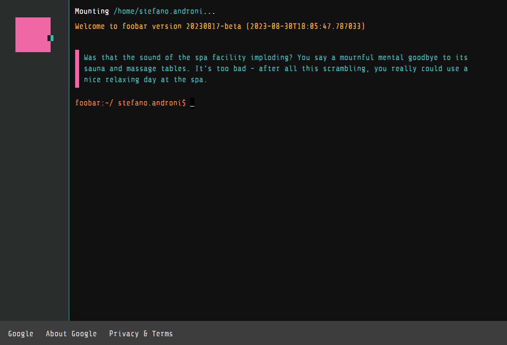

# Google Foobar Challenge

This repository contains my solutions to the Google Foobar Challenge. 

*(for each challenge: -text problem file -soution file)*  
*(constraint file for challenge: [constraints.md](constraints.md))*

<a href="https://foobar.withgoogle.com/" target="_blank" rel="noopener noreferrer"><a/>

## What is Google Foobar?
The Google Foobar is a secret hiring process that Google uses to identify and recruit developers and programmers from all over the world. The challenge consists of a series of coding challenges that are designed to test your skills and knowledge.

*Access is by invitation only*.

## My Solutions
- **Level 1**
  - [Braille translation](level1/braille_translation) *(Java)*
- **Level 2**
  - [Please Pass the Coded Messages](level2/please_pass_the_coded_messages) *(Java)*
  - [Power Hungry](level2/power_hungry) *(Java)*
- **Level 3**
  - [Fuel Injection Perfection](level3/fuel_injection_perfection) *(Python)*
  - [Prepare the Bunnies' Escape](level3/prepare_the_bunnies_escape) *(Python)*
  - [The Grandest Staircase Of Them All](level3/the_grandest_staircase_of_them_all) *(Python)*
- **Level 4**
  - [Distract the Trainers](level4/distract_the_trainers) *(Python)*
  - [Free the Bunny Workers](level4/free_the_bunny_workers) *(Python)*
- **Level 5**
  - [Dodge the Lasers!]() *(Python)* (in progress)
